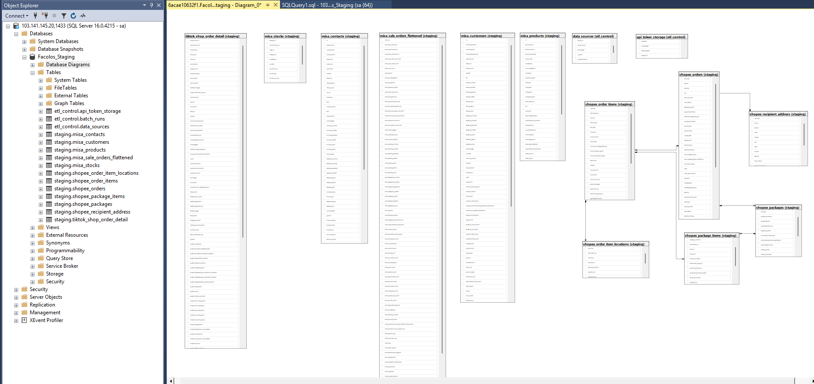
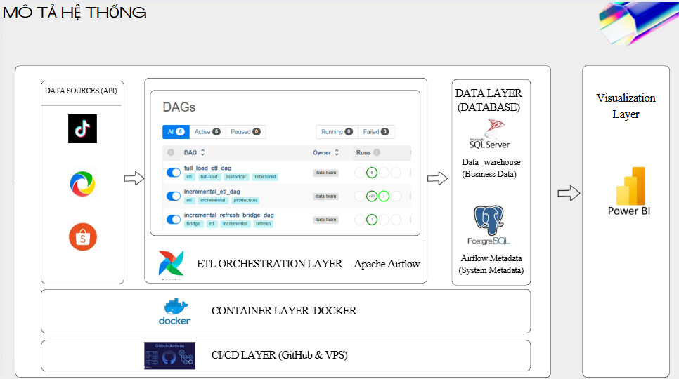
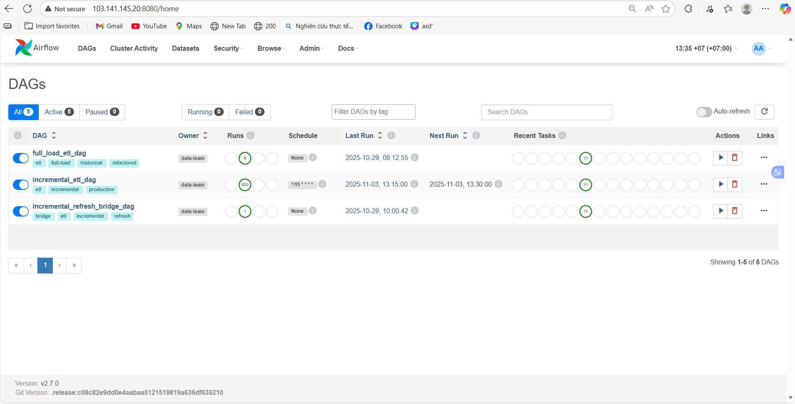
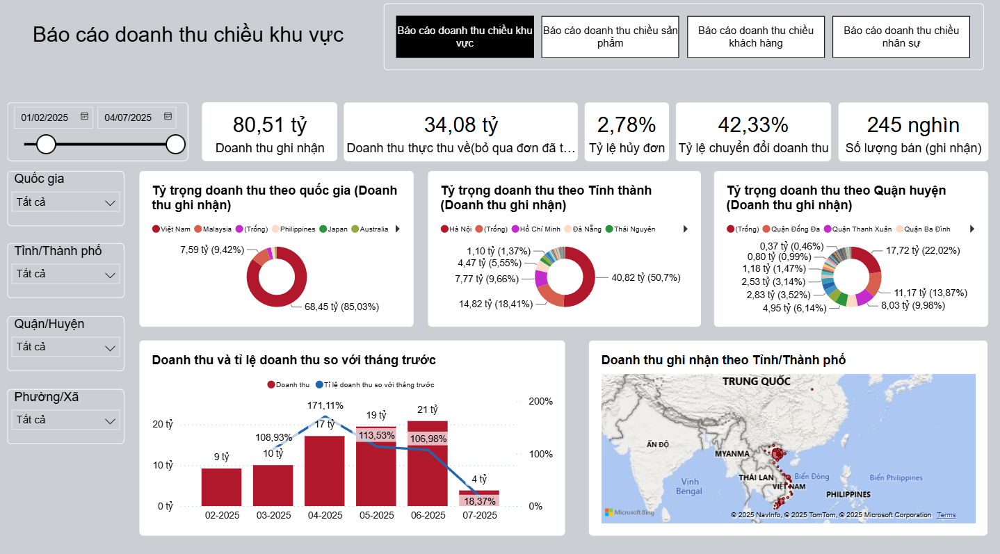
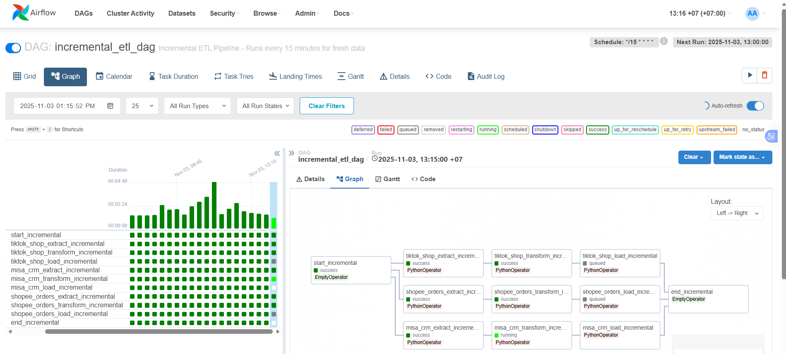

# Hệ Thống ETL Enterprise Multi-Platform

Hệ thống ETL tập trung dữ liệu từ TikTok Shop, MISA CRM và Shopee vào SQL Server Data Warehouse.

## Tính Năng

- **Full Load ETL**: Lấy toàn bộ dữ liệu historical từ 3 platforms
- **Incremental ETL**: Tự động cập nhật mỗi 15 phút
- **Parallel Processing**: 3 platforms xử lý đồng thời
- **Batch Updates**: Tối ưu hóa hiệu suất với batch processing
- **Enterprise Ready**: Docker + Airflow production-grade
- **Scalable**: Sẵn sàng tích hợp thêm platforms

## Database Schema



### Tổng số bảng: **15 bảng**

#### ETL Control (3 bảng)
- **`etl_control.batch_runs`**: Theo dõi các batch ETL đã chạy
- **`etl_control.data_sources`**: Quản lý nguồn dữ liệu
- **`etl_control.api_token_storage`**: Lưu trữ và quản lý API tokens

#### TikTok Shop (1 bảng)
- **`staging.tiktok_shop_order_detail`**: Order details với flattened line items (115+ columns)

#### MISA CRM (5 bảng)
- **`staging.misa_customers`**: Customer master data 
- **`staging.misa_sale_orders_flattened`**: Flattened order items với order details
- **`staging.misa_contacts`**: Contact person data
- **`staging.misa_stocks`**: Stock/warehouse data
- **`staging.misa_products`**: Product catalog

#### Shopee Platform (6 bảng normalized)
- **`staging.shopee_orders`**: Main orders table
- **`staging.shopee_recipient_address`**: Delivery addresses
- **`staging.shopee_order_items`**: Order line items
- **`staging.shopee_order_item_locations`**: Item locations
- **`staging.shopee_packages`**: Package information
- **`staging.shopee_package_items`**: Items in packages

### ERD Design (Shopee)
```
shopee_orders (order_sn PK)
├── shopee_recipient_address (order_sn PK/FK)
├── shopee_order_items (order_sn, order_item_id, model_id PK)
│   └── shopee_order_item_locations (order_sn, order_item_id, model_id, location_id PK)
└── shopee_packages (order_sn, package_number PK)
    └── shopee_package_items (order_sn, package_number, order_item_id, model_id PK)
```

## Kiến Trúc




## Cài Đặt & Triển Khai

### 1. Prerequisites

- Docker + Docker Compose 
- **TikTok Shop API**: App Key, Secret, Access Token, Refresh Token, Shop Cipher
- **MISA CRM API**: Client ID, Client Secret, Access Token
- **Shopee API**: Partner ID, Partner Key, Shop ID, Access Token, Refresh Token
- **SQL Server**: Database connection credentials
- **Minimum**: 4GB RAM cho containers


**Lưu ý quan trọng**: File `.env` đã được thêm vào `.gitignore` để không commit lên repository. Luôn sử dụng `.env.example` làm template.

### 2. Khởi Động Hệ Thống

```bash
# Khởi động toàn bộ system
docker-compose up -d

# Kiểm tra containers đang chạy
docker-compose ps

# Theo dõi logs của webserver
docker-compose logs -f airflow-webserver
```

### 3. Truy Cập Dashboard

- **Airflow Web UI**: http://localhost:8080
  - Username: `admin`
  - Password: `facolos2024` (mặc định, có thể thay đổi trong docker-compose.yml)
- **Database**: SQL Server trên port 1433 (development connection)



## Dashboard & Báo Cáo

### Power BI Dashboard

Truy cập dashboard báo cáo tổng quan dữ liệu ETL:

**[Xem Dashboard Power BI](https://app.powerbi.com/view?r=eyJrIjoiMWIzMjIyOTktOTVlMC00YWExLTk4ZWItMzJjZjNmMmEyNzY3IiwidCI6ImFmMWYzNzUzLTM5MjUtNGU2Zi05NDliLTk3YzAwNzMyMDgwMyIsImMiOjEwfQ%3D%3D)**



Dashboard cung cấp:
- Tổng quan dữ liệu từ 3 platforms (TikTok Shop, MISA CRM, Shopee)
- Thống kê đơn hàng theo thời gian
- Phân tích hiệu suất ETL pipeline
- Báo cáo real-time và historical data

## Sử Dụng ETL Pipeline

### Full Load (Lần đầu - 1 lần)

1. **Trigger Full Load DAG:**
   - Vào Airflow UI → DAGs → `full_load_etl_dag`
   - Click "Trigger DAG" để chạy một lần duy nhất
   - Quá trình sẽ lấy TẤT CẢ dữ liệu historical từ:
     - **TikTok Shop**: Từ 1/7/2024 đến hiện tại
     - **MISA CRM**: Tất cả customers, products, orders, contacts, stocks
     - **Shopee**: Auto-detect earliest order date (tối đa 2 năm) hoặc từ ngày cấu hình

2. **Monitoring:**
   - Theo dõi progress trên Airflow UI
   - Check data trong SQL Server tables
   - Logs chi tiết trong `/logs/` folder



### Incremental Updates (15 phút/lần)

Theo mặc định sẽ **TỰ ĐỘNG CHẠY** mỗi 15 phút:

- **TikTok Shop**: Dữ liệu đơn hàng mới/cập nhật trong 15 phút gần nhất  
- **MISA CRM**: Khách hàng, đơn hàng, sản phẩm, kho và liên hệ được cập nhật
- **Shopee**: Đơn hàng mới trong 15 phút gần nhất với auto token refresh
- **UPSERT Logic**: Không tạo duplicate, chỉ update dữ liệu có thay đổi


### Dừng Hệ Thống

```bash
# Dừng containers
docker-compose down

# Dừng và xóa volumes (xóa dữ liệu)
docker-compose down -v
```

## Configuration

**Schedule**: 
- Full Load: Manual trigger (1 lần đầu)
- Incremental: Mỗi 15 phút tự động

